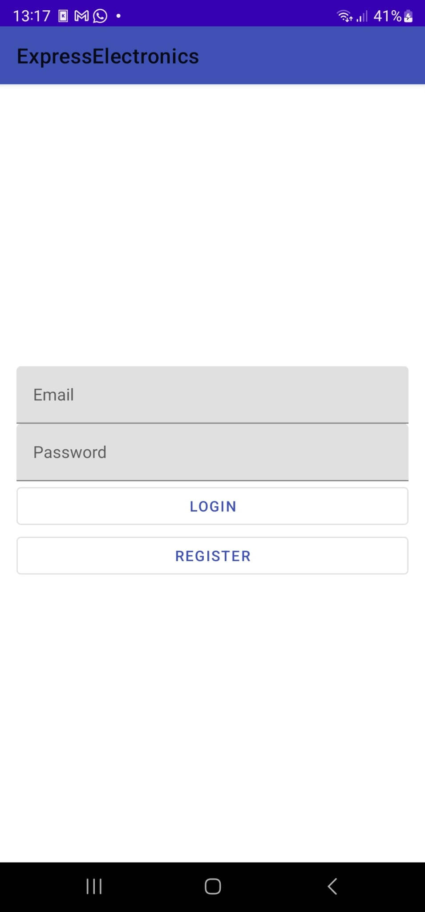
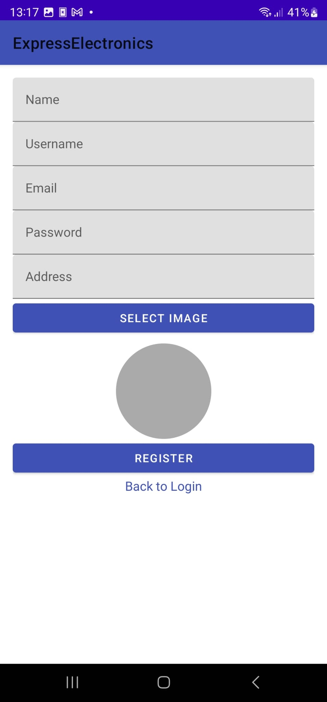
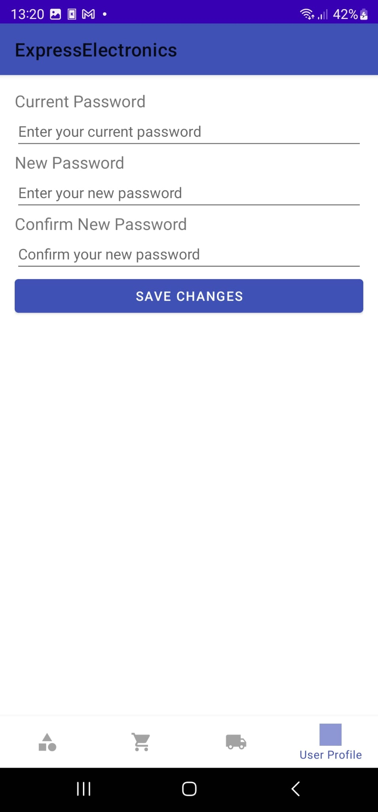
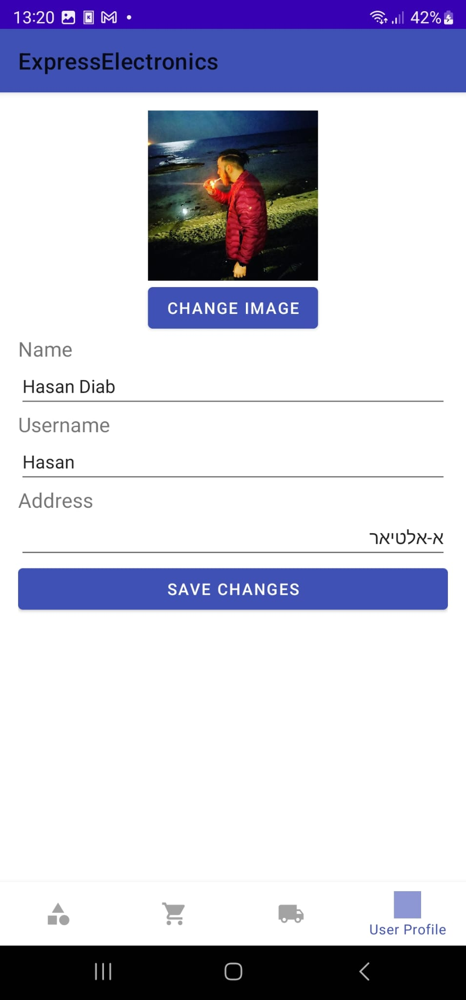
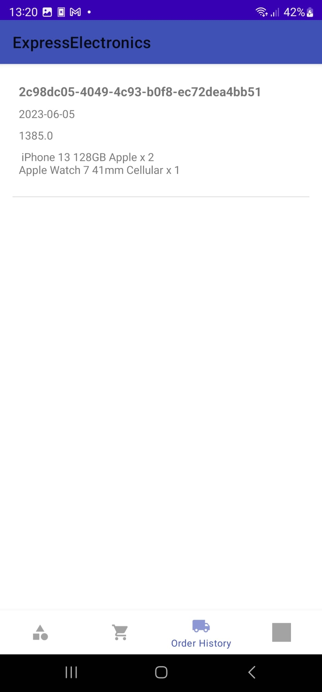
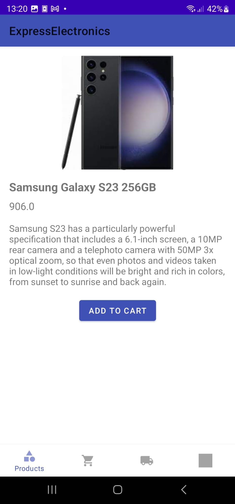
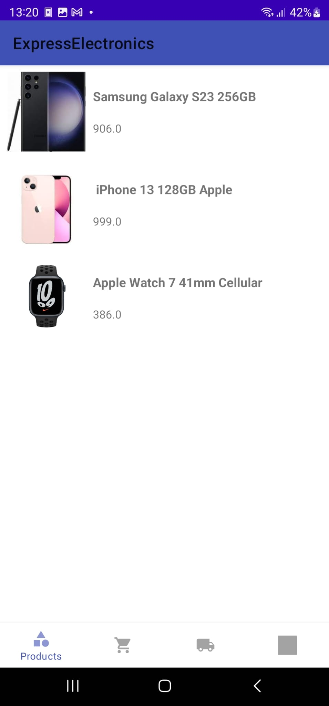
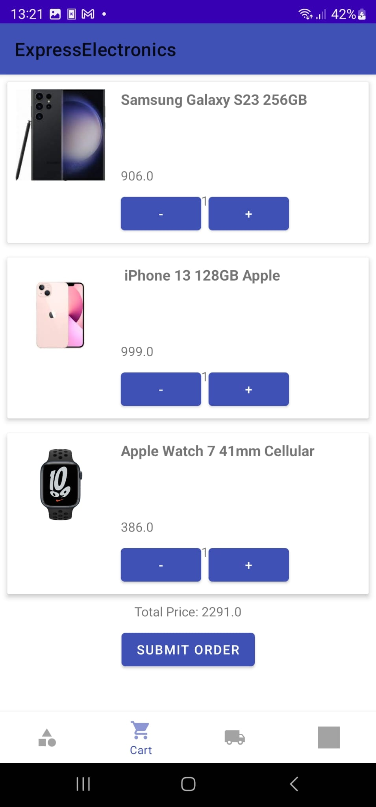
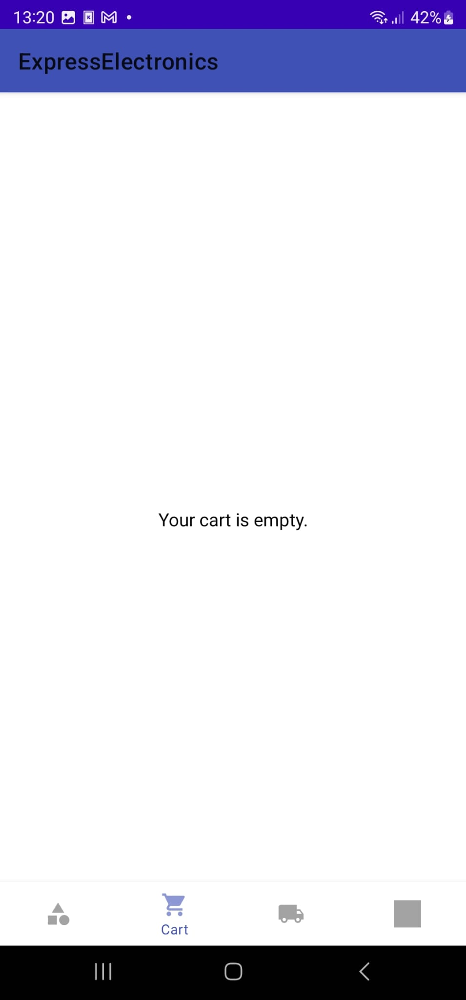
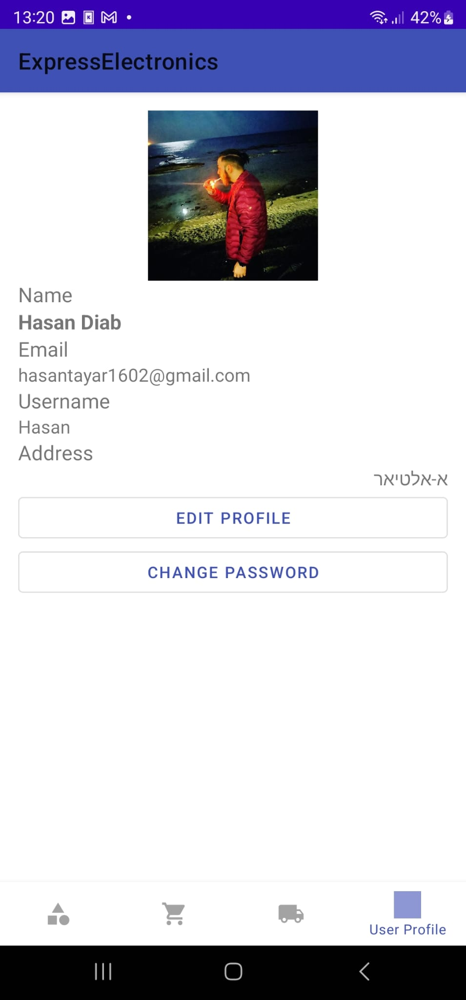

# ExpressElectronics-Android-App

ExpressElectronics is an Android application built with Android Studio and Firestore as the database. This app has user authentication and utilizes Firebase storage.

## Features

- User authentication
- Firebase storage integration
- Firestore database

## Activities

- Login Activity
- Register Activity

## Fragments

1. EditPasswordProfileFragment
2. EditProfileFragment
3. OrderHistoryFragment
4. PaymentFragment
5. ProductDetailsFragment
6. ProductFragment
7. ShoppingCartFragment
8. UserProfileFragment
9. 
### Login Activity

### Register Activity

### EditPasswordProfileFragment

### EditProfileFragment

### OrderHistoryFragment

### ProductDetailsFragment

### ProductFragment

### ShoppingCartFragment

### UserProfileFragment

## Building and Running

You will need Android Studio and Firebase account credentials to build and run this app.

1. Clone the repository
2. Open the project in Android Studio
3. Connect the app with your Firebase
4. Build and Run

## Contribute

Contributions are welcome. Please open up an issue or create PR if you would like to help.

## License

This project is licensed under the MIT License.
